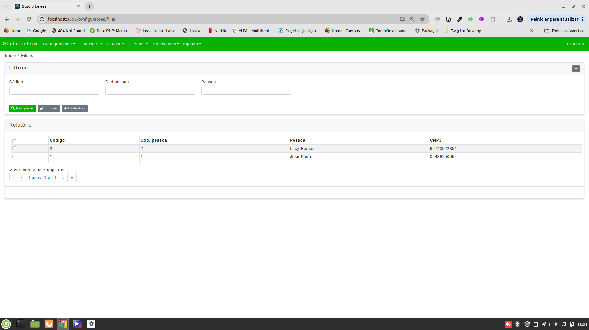

# React Application for Service-Based Businesses

This application is designed for service-based businesses like aesthetic clinics and health professionals. It includes screens for Dashboard widgets, Accounts Receivable, Financial Transactions, Branches, and much more. The system consumes a RESTful API.

## Table of Contents

- [Introduction](#introduction)
- [Prerequisites](#prerequisites)
- [Installation](#installation)
- [Configuration](#configuration)
- [Running the Application](#running-the-application)
- [Screenshots](#screenshots)
- [API Reference](#api-reference)
- [License](#license)

## Introduction

This React application helps manage various aspects of service-based businesses. It provides an intuitive interface to track accounts receivable, manage financial transactions, monitor multiple branches, and much more.

## Prerequisites

Before you begin, ensure you have met the following requirements:

- Node.js (v14.x or later)
- npm (v6.x or later) or yarn (v1.x or later)
- Git

## Installation

Follow these steps to set up the development environment:

1. Clone the repository:
   ```bash
   git clone https://github.com/pedro162/clinica_estetica.git
   ```
2. Navigate to the project directory:
   ```bash
   cd your-repo-name
   ```
3. Install the dependencies:
   ```bash
   npm install
   ```
   or
   ```bash
   yarn install
   ```

## Configuration

1. Create a `.env` file in the root directory of the project.
2. Add the necessary environment variables. For example:
   ```
   REACT_APP_API_BASE_URL=https://api.yourdomain.com
   ```

## Running the Application

To run the application in development mode, use the following command:

```bash
npm start
```

````

or

```bash
yarn start
```

Open [http://localhost:3000](http://localhost:3000) to view it in the browser.

## Screenshots

### Dashboard Widgets

The Dashboard provides a quick overview of key metrics and widgets that help in monitoring the performance and status of the business.


### Accounts Receivable

The Accounts Receivable screen helps in tracking the amounts due from clients, managing invoices, and monitoring payment statuses.


### Financial Transactions

The Financial Transactions screen allows users to record and monitor all financial activities, ensuring accurate bookkeeping and financial management.


### Branches

The Branches screen provides a detailed view of different branches of the business, including their performance metrics and other relevant information.



## API Reference

This application consumes a RESTful API to perform CRUD operations and fetch data. Ensure your API is running and accessible at the base URL specified in the `.env` file.

## License

This project is licensed under the MIT License - see the [LICENSE](LICENSE) file for details.


````
